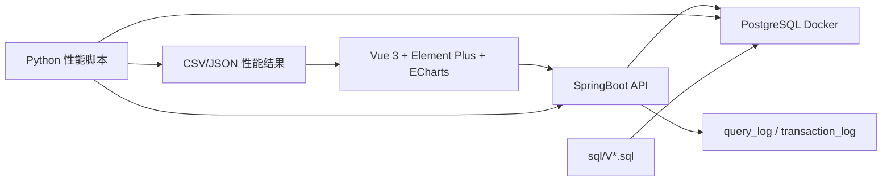

# 架构设计文档

## 1. 总体架构



## 2. 分层职责

| 层 | 内容 | 负责人 | 契约 |
|---|---|---|---|
| 前端展示层 | Vue 页面、表单、表格、ECharts、Mock JSON | C | `docs/api/mock-contract.md` |
| 后端服务层 | Controller、Service、DTO/VO、事务、异常处理 | B | `docs/api/api-contract.md` |
| 数据库层 | 表、约束、SQL、触发器、存储过程、索引 | A | `docs/database/database-design.md` |
| 环境与实验层 | Docker、dbgen、COPY、性能测试、报告整合 | D | `docs/database/sql-execution-and-import.md` |

## 3. 数据流

### 3.1 TPC-H 查询

```text
前端选择参数
-> GET /api/tpch/q*
-> B 校验参数并记录开始时间
-> B 调用 Mapper/JDBC 执行 A 提供的 SQL
-> B 将 snake_case 结果映射为 lowerCamelCase
-> 返回 records/chartData/elapsedMs
-> C 展示表格和图表
```

### 3.2 TPC-C 事务

```text
前端提交事务表单
-> POST /api/tpcc/new-order 或 /api/tpcc/payment
-> B 开启 Spring 事务
-> 执行 A 提供的事务 SQL 流程
-> 更新库存或余额
-> 写 transaction_log 和 stock_change_log
-> 成功 commit，失败 rollback
-> 返回 transactionId/status/elapsedMs
```

### 3.3 系统演示导入

```text
C 上传文件
-> B 创建 import_task
-> B 分批读取和校验
-> 合法数据批量入库
-> 错误行写 import_error_log
-> C 轮询任务状态并展示进度
```

### 3.4 正式数据导入

```text
D 使用 dbgen 生成 tbl/txt 数据
-> D 启动 PostgreSQL Docker
-> 执行建表脚本
-> COPY 导入 TPC-H 数据
-> 加约束、触发器、存储过程、索引
-> 统计行数并保存日志
```

## 4. 技术选型

| 模块 | 技术 |
|---|---|
| 前端 | Vue 3、Element Plus、ECharts、Axios、Pinia |
| 后端 | SpringBoot、MyBatis 或 JDBC、Spring Transaction |
| 数据库 | PostgreSQL 16 Docker |
| 性能测试 | Python 多线程脚本 |
| 文档与协作 | Markdown、Git 分支、PR 合并 |

## 5. 关键架构约束

```text
数据库字段不直接暴露给前端。
API DTO/VO 是前后端唯一接口模型。
Mock JSON 与真实 API 字段必须一致。
Docker init 只调用 sql/，不复制业务 SQL。
正式导入和开发初始化使用不同执行顺序。
```

